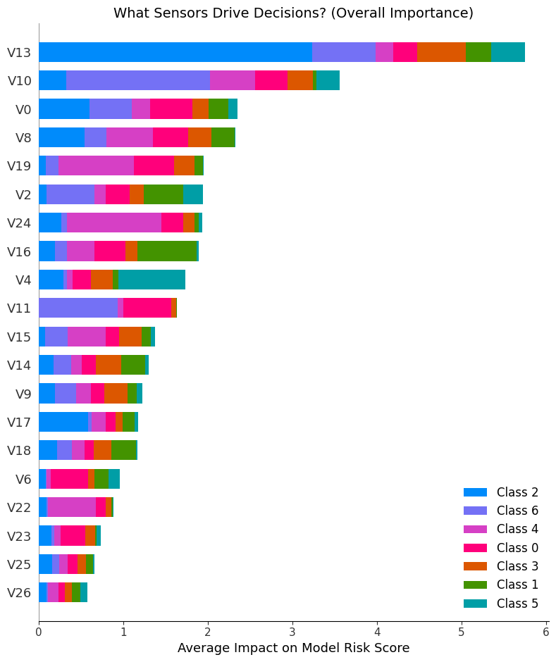
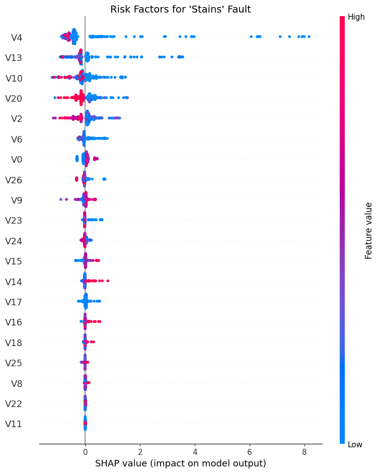
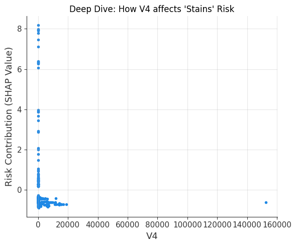

# Steel Plate Faults Analysis & SHAP Interpretability


This project leverages machine learning (LightGBM) to perform multi-class fault prediction on the **UCI Steel Plates Faults Data Set**. Beyond prediction, it integrates the **SHAP (SHapley Additive exPlanations)** framework to deconstruct the "black box" model, providing a deep dive into the key physical features driving specific defects—with a special focus on "Stains."

##  Project Results Overview

Through SHAP analysis, I revealed the deep connections between sensor data and fault types.

### 1. Global Feature Importance



**Key Findings:**
* **Top Predictors:** `V13`, `V10`, and `V0` are the dominant features, serving as the primary basis for distinguishing between fault classes.
* **Class-Specific Fingerprints:** Feature influence is highly non-uniform:
    * **V13** (Top bar) is decisive for identifying **Class 2** (Blue) and **Class 6** (Purple).
    * **V0** plays a major role in determining **Class 0** (Pink).
    * This suggests that different physical faults have distinct "feature fingerprints."

---

### 2. Risk Factor Analysis for "Stains" (Beeswarm Plot)



**Key Findings:**
* **V4 is the Decisive Indicator:** `V4` sits at the very top, making it the most critical feature for judging "Stains."
* **"Low Value" = High Risk:** The color distribution reveals a clear pattern:
    * **Blue dots** (Low feature values) are concentrated on the **right side** (Positive SHAP value), meaning low `V4` values push the model toward predicting "Stains."
    * **Red dots** (High feature values) are on the left, inhibiting the risk.
* **Supporting Features:** `V13` and `V10` show similar trends—lower values are generally associated with higher fault risk.

---

### 3. Deep Dependence Analysis: The Impact of V4



**Key Findings:**
* **The "L" Shaped Threshold:** A distinct non-linear trend is visible.
    * **Danger Zone:** When `V4` values fall into the low range (**0 to ~5000**), the risk contribution (SHAP value) spikes dramatically, reaching up to **8.0**.
    * **Safe Zone:** As `V4` exceeds **10,000**, the SHAP values drop rapidly and stabilize near 0 or become negative.
* **Conclusion:** This confirms that **extremely small V4 readings** are a strong warning signal for "Stains" faults.

---

##  Tech Stack & Workflow

### Data Processing Pipeline
1.  **Data Source:** UCI Machine Learning Repository (Steel Plates Faults).
2.  **Cleaning:** * Removed conflicting rows containing multiple ground-truth labels.
3.  **Feature Selection:** * Removed redundant features with correlation coefficients > 0.95 to reduce multicollinearity.

### Modeling
* **Algorithm:** LightGBM Classifier
* **Strategy:** Used `class_weight='balanced'` to handle class imbalance.
* **Performance:** Test set accuracy achieved **~81.23%**.

### Explainable AI (XAI)
Used `shap.TreeExplainer` to interpret the trained model:
* **Multi-class Support:** Extracted SHAP values specifically for the "Stains" class.
* **Visualization:** Summary Plot (Bar & Beeswarm) and Dependence Plot.

##  Quick Start

### Dependencies
Ensure the following Python libraries are installed:

```bash
pip install numpy pandas matplotlib lightgbm shap scikit-learn
